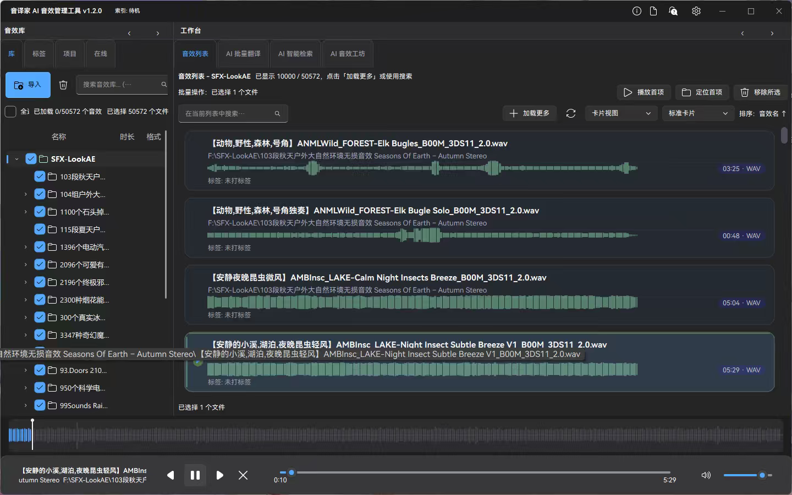

# 音译家 AI 音效管理工具 v1.2.0

<div align="center">



**面向音效从业者的本地优先 AI 音效管理平台**

[](https://www.gnu.org/licenses/old-licenses/gpl-2.0.en.html)
[](https://www.python.org/downloads/)
[](https://www.qt.io/qt-for-python)

</div>

---

## 项目简介

音译家（Transcriptionist v3）用于管理大体量音效素材，核心目标是：

- 让音效库在万级以上数据下仍可用、可检索、可维护。
- 提供 AI 翻译、AI 检索、自动打标、在线资源工作流。
- 保持本地优先的数据闭环（数据库、索引、可回滚重命名）。

---

## v1.2.0 核心更新

本次版本是一次系统级重构，重点覆盖 UI、性能、翻译链路和 AI 音效生成。

### 1) 音效库体验与波形系统

- 卡片视图波形升级为更专业观感（线宽、间距、对比度、频段偏置）。
- 波形主题色与全局主题联动，移除硬编码色值。
- 新增波形线程配置：默认推荐值 + 手动可调（设置页可控，运行时生效）。

### 2) 设置页重构与配置治理

- 恢复并修复设置页关键模块（外观、性能、AI 配置链路）。
- 清理重复推荐文案与旧死代码，降低后续回归风险。
- 新增可灵（Kling）音效服务商配置区，支持 AK/SK、Base URL、鉴权检测。

### 3) AI 音效工坊（替代旧 MusicGen 路线）

- 模块升级为“AI 音效工坊”，接入可灵文本生音效能力。
- 生成参数（如时长）与 API 限制对齐，不再是假 UI。
- 旧 MusicGen 配置入口下线并做代码级清理。

### 4) AI 翻译链路稳定性

- 翻译任务落库与应用替换统一走数据库主链路。
- 修复“翻译后替换/撤销导致路径异常、文件不存在”等问题。
- 文件与文件夹翻译均可回退兜底，避免空翻译导致脏命名。

### 5) 构建与发布

- PyInstaller 构建脚本升级：资源预检、打包校验、安装包联动。
- 安装包与绿色版统一中文命名：`音译家AI音效管理工具1.2.0`。
- 修复 PyInstaller `_internal` 布局下的误报校验问题。

---

## 主要功能

- 本地音效库管理（树形结构、卡片/表格视图、批量操作）
- AI 批量翻译（术语库、命名模板、清洗规则联动）
- AI 智能检索（向量检索与相关排序链路）
- AI 自动打标与标签管理
- 在线资源检索与导入
- AI 音效工坊（文本生成音效）

---

## 快速开始

### 运行源码

```bash
git clone https://github.com/lid664951-crypto/transcriptionist-v3.git
cd transcriptionist-v3
pip install -r requirements.txt
python -m transcriptionist_v3
```

### Windows 快速运行

- 直接运行：`run.bat`
- Qt 启动脚本：`run_qt.bat`

---

## 打包发布

### PyInstaller（当前主发布链路）

```bat
build.bat
```

产物默认位于：

- 绿色版目录：`dist/音译家AI音效管理工具1.2.0`
- 安装包：`dist/音译家AI音效管理工具1.2.0.exe`

---

## 文档索引

- 版本更新详单：`docs/UPDATE_LOG_v1.2.0_COLLAB_DETAILED.md`
- 发布说明：`docs/RELEASE_NOTES_v1.2.0.md`
- 实施计划：`docs/IMPLEMENTATION_PLAN_v1.2.0.md`
- 压测指南：`docs/STRESS_TEST_GUIDE_v1.2.0.md`

---

## 工程说明

- 本项目在产品与交互层面参考了行业工具方法论（含 Soundly 使用流程研究），
  目标是学习其产品思想并结合本项目业务做独立实现。
- 项目持续按“配置化、任务化、可观测、可回滚”方向迭代。

---

## 许可证

本项目采用 [GPL-2.0](LICENSE) 开源协议。

---

## 联系与反馈

- Issues：<https://github.com/lid664951-crypto/transcriptionist-v3/issues>
- 仓库：<https://github.com/lid664951-crypto/transcriptionist-v3>

