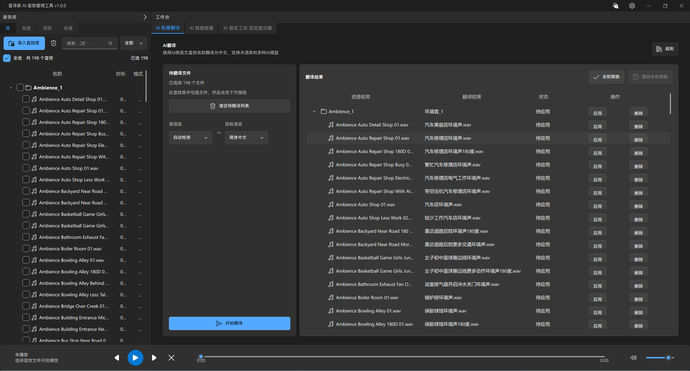
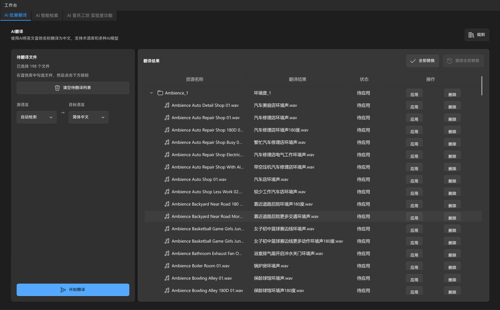
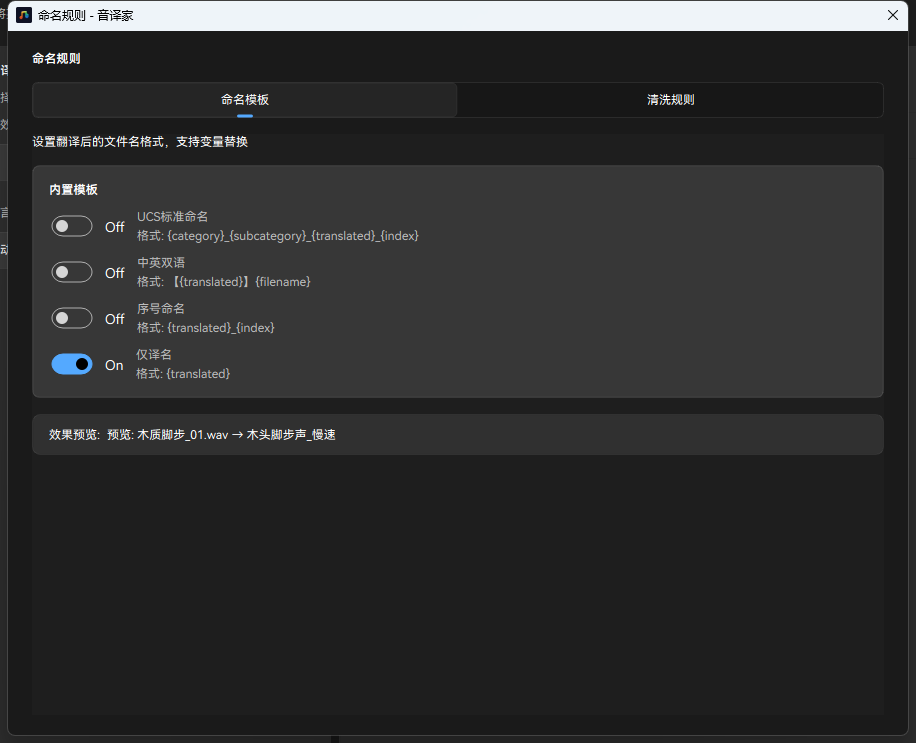
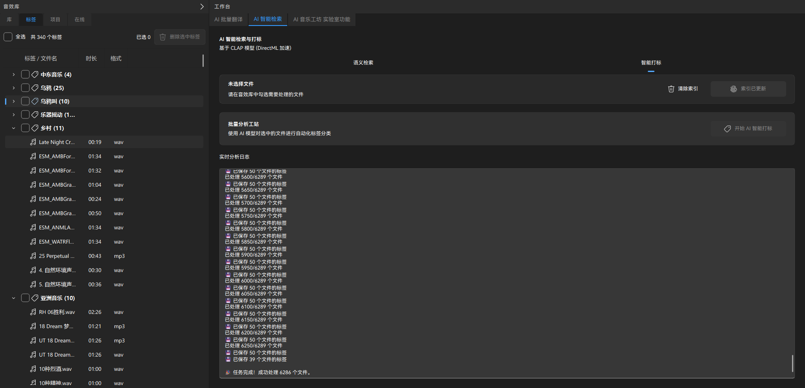
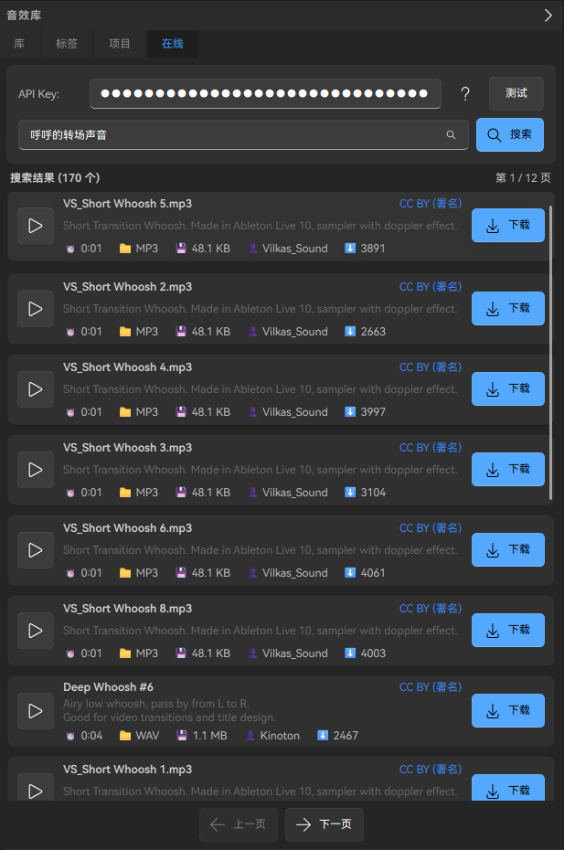
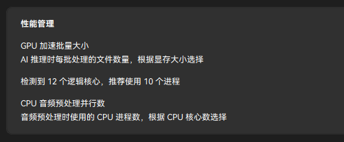

# 音译家 AI 音效管理工具 v1.0

<div align="center">



**一款专为音效从业者打造的 AI 驱动音效库管理系统**

[](https://www.gnu.org/licenses/old-licenses/gpl-2.0.en.html)
[](https://www.python.org/downloads/)
[](https://www.qt.io/qt-for-python)

[功能特性](#-功能特性) • [快速开始](#-快速开始) • [使用指南](#-使用指南) • [技术架构](#️-技术架构) • [开发指南](#-开发指南) • [贡献](#-贡献)

</div>

---

## 📖 简介

音译家 AI 音效管理工具是一个完整的音效库管理系统，集成了 AI 智能翻译、智能检索、自动打标、在线资源搜索等功能。如果你手里有几千上万个音效文件，每次找个音效都要翻半天，或者经常需要去网上找素材，那这个工具就是为你准备的。

### 为什么选择音译家？

- 🎯 **AI 智能检索**：用自然语言描述就能找到音效，不用记复杂的文件名
- 🌐 **批量翻译**：支持 DeepSeek、豆包、ChatGPT，快速翻译音效文件名
- 🏷️ **自动打标**：AI 自动给音效打标签，分类整理更轻松
- 🌍 **在线搜索**：集成 Freesound 音效库，在线试听批量下载
- 🎵 **音乐生成**：实验性功能，用文字描述生成音乐片段
- ⚡ **GPU 加速**：支持 GPU 加速，建立索引速度快 5-6 倍

---

## ✨ 功能特性

### 1. 音效库管理


- 导入文件夹自动扫描所有音效
- 树形结构展示，保留原文件夹层级
- 支持 WAV、FLAC、MP3、OGG、AIFF、M4A 等格式
- 高级搜索：按文件名、时长、标签、通配符筛选
- 内置音频播放器，支持音量控制

### 2. AI 智能翻译



- 支持 DeepSeek、豆包、ChatGPT、智谱等大语言模型
- 内置多种命名规则预设（中英双语、UCS 规范等）
- 清洗规则自动移除文件名冗余字符
- 批量替换预览，支持撤销操作
- 翻译缓存，避免重复翻译



### 3. AI 智能检索


- 基于微软开源的 CLAP 模型
- 用自然语言搜索音效（如"森林鸟叫声"、"爆炸声"）
- 支持 GPU 加速，搜索速度快
- 索引自动保存，下次打开直接用
- 多进程 + GPU 并行，建立索引速度提升 5-6 倍

### 4. AI 智能打标



- 自动给音效打标签（环境音、打击乐、人声等）
- 标签直接显示在标签栏
- 支持按标签搜索和筛选
- 批量打标，后台线程处理不卡顿

### 5. 在线资源搜索



- 集成 Freesound 音效库（全球最大免费音效平台）
- 在线试听，批量下载
- AI 智能优化搜索词，中文自动翻译润色
- 下载队列管理
- 下载的音效可直接导入本地库

### 6. AI 音乐工坊（实验性）

- 基于 Meta 的 MusicGen 模型
- 用文字描述生成音乐片段
- ONNX 格式部署，轻量化
- 功能还在完善中

---

## 🚀 快速开始

### 系统要求

- **操作系统**：Windows 10/11（64位）
- **内存**：建议 8GB 以上
- **显卡**：支持 CUDA 的 NVIDIA 显卡（可选，用于 GPU 加速）
- **硬盘空间**：至少 2GB 可用空间


### 下载安装

1. 从 [Releases](https://github.com/lid664951-crypto/transcriptionist-v3/releases) 下载最新版本的压缩包
2. 解压到本地任意目录
3. 运行 `音译家 AI 音效管理工具.exe`

> **注意**：Windows 11 可能会提示"此应用有风险"，这是正常的系统安全提示。点击"更多信息" → "仍要运行"即可。软件是开源的，代码透明，可以放心使用。

### 首次配置

1. 打开软件后，点击右上角的设置按钮
2. 填写 AI 大模型 API Key（推荐使用 DeepSeek，申请简单费用低）
3. 到 AI 模型管理板块，下载 AI 检索模型（必须）
4. AI 音乐生成模型可选择性下载
5. 点击返回按钮回到主页



### API 申请指南

**DeepSeek API（推荐）**：
1. 访问 [DeepSeek 开放平台](https://platform.deepseek.com/)
2. 注册账号并登录
3. 在 API Keys 页面创建新的 API Key
4. 复制 API Key 到软件设置中

**其他模型**：
- 豆包：[火山引擎](https://www.volcengine.com/)
- ChatGPT：[OpenAI Platform](https://platform.openai.com/)
- 智谱：[智谱 AI 开放平台](https://open.bigmodel.cn/)

---

## 📚 使用指南

### 基础使用流程

1. **导入音效库**
   - 在左侧音效库页面点击"导入音效库"
   - 选择你的音效文件夹
   - 软件会自动扫描所有音频文件

2. **翻译音效名称**
   - 到中间的 AI 批量翻译板块
   - 点击规则按钮设置命名模板和清洗规则
   - 在音效库全选音频文件
   - 选择目标语言，点击开始翻译
   - 翻译完成后点击全部替换

3. **智能检索音效**
   - 到 AI 智能检索板块
   - 首次使用需要建立索引（几千个文件约半小时）
   - 输入自然语言描述（如"森林鸟叫声"）
   - 查看匹配结果，点击试听

4. **自动打标签**
   - 在 AI 智能检索板块
   - 选择要打标的文件
   - 点击开始打标
   - 标签会自动显示在标签栏

5. **在线搜索下载**
   - 到在线资源搜索板块
   - 配置 Freesound API Key
   - 输入关键词搜索
   - 在线试听，批量下载

### 性能优化建议

如果你的电脑配置比较好，可以在设置里调整性能参数：

**GPU 加速批量大小**：
- 显存 4GB：建议 8
- 显存 8GB：建议 16
- 显存 16GB：建议 32

**CPU 音频预处理并行数**：
- 4 核：建议 3-4
- 6 核：建议 5-6
- 8 核及以上：建议 7-8

软件会根据你的硬件自动推荐，也可以自己调整。

---

## 🛠️ 技术架构

### 核心技术栈

- **开发语言**：Python 3.11+
- **GUI 框架**：PySide6（Qt for Python）
- **UI 组件库**：qfluentwidgets（Fluent Design）

### AI 模型

- **CLAP**：微软开源的音频-文本对比学习模型，用于智能检索和打标
- **ONNX Runtime**：模型推理引擎，支持 GPU 加速
- **大语言模型**：DeepSeek、豆包、ChatGPT、智谱等，用于翻译
- **MusicGen**：Meta 开源的音乐生成模型（ONNX 格式）

### 音频处理

- **Librosa**：音频特征提取，生成梅尔频谱图
- **Mutagen**：音频元数据读写，支持多种格式
- **PyAudio / sounddevice**：音频播放

### 数据存储

- **SQLite**：本地数据库，存储音效库信息和索引
- **JSON**：配置文件和缓存

### 性能优化

- **多进程**：音频预处理使用多进程，绕过 Python GIL 锁
- **GPU 并行**：模型推理使用 GPU 批量处理
- **异步处理**：后台线程处理耗时任务，不阻塞 UI

---

## 💻 开发指南

### 从源码运行

1. **克隆仓库**
```bash
git clone https://github.com/lid664951-crypto/transcriptionist-v3.git
cd transcriptionist-v3
```

2. **安装依赖**
```bash
pip install -r requirements.txt
```

3. **运行软件**
```bash
python -m transcriptionist_v3
# 或
python __main__.py
```

### 项目结构

```
transcriptionist_v3/
├── application/          # 应用层（业务逻辑）
│   ├── ai/              # AI 相关服务
│   ├── ai_engine/       # AI 引擎（翻译、打标）
│   ├── library_manager/ # 音效库管理
│   ├── naming_manager/  # 命名规则管理
│   ├── online_resources/# 在线资源（Freesound）
│   ├── playback_manager/# 播放管理
│   └── search_engine/   # 搜索引擎
├── domain/              # 领域层（模型、接口）
│   ├── models/          # 数据模型
│   ├── interfaces/      # 接口定义
│   └── exceptions/      # 异常定义
├── infrastructure/      # 基础设施层
│   ├── database/        # 数据库
│   ├── ai_models/       # AI 模型加载
│   └── external_apis/   # 外部 API
├── ui/                  # 用户界面层
│   ├── pages/           # 页面
│   ├── widgets/         # 组件
│   ├── dialogs/         # 对话框
│   └── layouts/         # 布局
├── core/                # 核心模块
│   ├── config.py        # 配置管理
│   ├── i18n.py          # 国际化
│   └── fonts.py         # 字体管理
├── resources/           # 资源文件
│   ├── icons/           # 图标
│   ├── fonts/           # 字体
│   └── themes/          # 主题
├── data/                # 数据目录
│   ├── database/        # 数据库文件
│   ├── models/          # AI 模型文件
│   └── cache/           # 缓存
└── tests/               # 测试
    ├── unit/            # 单元测试
    └── integration/     # 集成测试
```


### 打包构建

使用 PyInstaller 打包：

```bash
# 安装打包依赖
pip install pyinstaller

# 执行打包
pyinstaller build.spec
```

打包后的文件在 `dist/音译家 AI 音效管理工具/` 目录下。

详细构建指南请参考 [BUILD_GUIDE.md](BUILD_GUIDE.md)

---

## 🤝 贡献

欢迎贡献代码、报告问题或提出建议！

### 如何贡献

1. Fork 本仓库
2. 创建你的特性分支 (`git checkout -b feature/AmazingFeature`)
3. 提交你的修改 (`git commit -m 'Add some AmazingFeature'`)
4. 推送到分支 (`git push origin feature/AmazingFeature`)
5. 开启一个 Pull Request

### 报告问题

如果你发现了 bug 或有功能建议，请在 [Issues](https://github.com/lid664951-crypto/transcriptionist-v3/issues) 中提出。

**特别希望音效从业者提建议**：
- 你们平时管理音效库最头疼的是什么？
- 希望增加哪些功能？比如音效分类、项目管理、云同步？
- AI 智能检索的准确度怎么样？有没有改进建议？
- 命名规则是否满足你们的工作流程？

---

## 📄 开源协议

本项目采用 [GPL-2.0 License](LICENSE) 开源协议。

### 关于 GPL-2.0

- ✅ 可以自由使用、修改、分发本软件
- ✅ 可以用于商业用途
- ⚠️ 修改后的代码必须同样开源（GPL-2.0）
- ⚠️ 必须保留原作者版权声明

### 第三方开源组件

本项目使用了以下开源组件：

- [Quod Libet](https://github.com/quodlibet/quodlibet) - GPL-2.0（音频处理和模式匹配）
- [PySide6](https://www.qt.io/qt-for-python) - LGPL
- [qfluentwidgets](https://github.com/zhiyiYo/PyQt-Fluent-Widgets) - GPL-3.0
- [CLAP](https://github.com/microsoft/CLAP) - MIT
- [MusicGen](https://github.com/facebookresearch/audiocraft) - MIT
- [Librosa](https://librosa.org/) - ISC
- [Mutagen](https://github.com/quodlibet/mutagen) - GPL-2.0

完整的第三方组件列表请参考 [GPL_COMPLIANCE_CHECKLIST.md](GPL_COMPLIANCE_CHECKLIST.md)

---

## 🙏 致谢

- 感谢 [Quod Libet](https://github.com/quodlibet/quodlibet) 项目提供的音频处理和模式匹配代码
- 感谢微软开源的 [CLAP](https://github.com/microsoft/CLAP) 模型
- 感谢 Meta 开源的 [MusicGen](https://github.com/facebookresearch/audiocraft) 模型
- 感谢所有开源社区的贡献者

---

## 📞 联系方式

- **问题反馈**：[GitHub Issues](https://github.com/lid664951-crypto/transcriptionist-v3/issues)
- **功能建议**：[GitHub Discussions](https://github.com/lid664951-crypto/transcriptionist-v3/discussions)
- **邮箱**：lid664951@gmail.com

---

## 📊 项目状态

- ✅ v1.0 已发布
- 🚧 持续优化中
- 📝 欢迎反馈和建议

---

<div align="center">

**如果这个项目对你有帮助，请给个 ⭐ Star 支持一下！**

Made with ❤️ by 音译家团队

</div>
